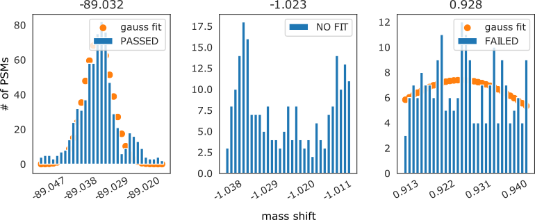
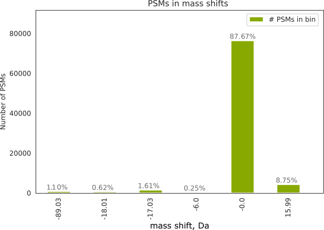
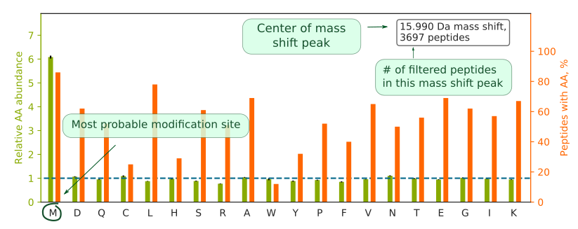

[](https://pypi.org/project/AA-stat/)

AA_stat
========
An open source software for amino acid residue modification analyses in proteomics


## Overview

**AA_stat** is a tool for shotgun proteomics
that uncovers the unexpected modifications of amino acid residues in the protein sequences,
as well as possible artefacts of data acquisition or processing, in the results of proteome analysis.
AA_stat calculates and visualizes amino acid occurrence frequencies for the identified peptides.
AA_stat processes the results of open search and composes a list of identified mass shifts
that can be attributed to modifications.
The processing involves Gaussian fitting of potential peaks, group-specific FDR filtering,
amino acid counting, and appearance frequency normalization for the particular mass shifts.
The algorithm was implemented in Python as an open-source command-line tool available at
[https://github.com/SimpleNumber/aa_stat](https://github.com/SimpleNumber/aa_stat).

Project moved from [https://bitbucket.org/J_Bale/aa_stat/](https://bitbucket.org/J_Bale/aa_stat/).

An example of AA_stat output can be found [here](https://gorshkovlab.github.io/aa_stat_reports/).
## Installation

Install from PyPI:

```
pip install AA_stat
```

Alternatively, you can install directly from GitHub:

```
pip install git+https://github.com/SimpleNumber/aa_stat
```

## Usage

Regular usage:

```
usage: AA_stat [-h] [--params PARAMS] [--dir DIR] [-v {0,1,2,3}] [--mgf MGF [MGF ...] | --mzml MZML [MZML ...]] (--pepxml PEPXML [PEPXML ...] | --csv CSV [CSV ...])

optional arguments:
  -h, --help            show this help message and exit
  --params PARAMS       CFG file with parameters. If there is no file, AA_stat uses default one. An example can be found at https://github.com/SimpleNumber/aa_stat
  --dir DIR             Directory to store the results. Default value is current directory.
  -v {0,1,2,3}, --verbosity {0,1,2,3}
                        Output verbosity.
  --mgf MGF [MGF ...]   MGF files to localize modifications.
  --mzml MZML [MZML ...]
                        mzML files to localize modifications.
  --pepxml PEPXML [PEPXML ...]
                        List of input files in pepXML format.
  --csv CSV [CSV ...]   List of input files in CSV format.

Instead of file lists, you can pass directory names. This will process all files in the directory.
```

Combine with open search:

```
AA_search [-h] [--params PARAMS] [--MSFragger MSFRAGGER] [--dir DIR] [-v {0,1,2,3}] (--mgf MGF [MGF ...] | --mzml MZML [MZML ...]) [-db FASTA] [--os-params OS_PARAMS] [-x] [-s [SKIP]] [-je JAVA_EXECUTABLE] [-ja JAVA_ARGS]

optional arguments:
  -h, --help            show this help message and exit
  --params PARAMS       CFG file with parameters. If there is no file, AA_stat uses default one. An example can be found at https://github.com/SimpleNumber/aa_stat
  --MSFragger MSFRAGGER
                        Path to MSFragger .jar file. If not specified, MSFRAGGER environment variable is used.
  --dir DIR             Directory to store the results. Default value is current directory.
  -v {0,1,2,3}, --verbosity {0,1,2,3}
                        Output verbosity.
  --mgf MGF [MGF ...]   MGF files to search.
  --mzml MZML [MZML ...]
                        mzML files to search.
  -db FASTA, --fasta FASTA
                        FASTA file with decoys for open search. None: with included MSFragger parameters, the database is expected to contain decoys. Default decoy prefix is "rev_". If it differs, do not forget to specify it in
                        AA_stat params file.
  --os-params OS_PARAMS
                        Custom open search parameters.
  -x, --optimize-fixed-mods
                        Run multiple searches, automatically determine which fixed modifications to apply.
  -s [SKIP], --skip [SKIP]
                        Skip search if pepXML files exist already. If not specified, no steps are skipped. If specified without value, first step may be skipped. Value is number of steps to skip. Only works with "-x".
  -je JAVA_EXECUTABLE, --java-executable JAVA_EXECUTABLE
  -ja JAVA_ARGS, --java-args JAVA_ARGS

```


### Configuration file


The AA_stat tool needs a **config** file and at least one **data** file with open search results.

An example of **config** file is included (**default.cfg**).

This file has following parameters:


| Name                             | Default value                            | Description                                                                |
| ---------------------------------|------------------------------------------|----------------------------------------------------------------------------|
|                                  | **[data]**                               |                                                                            |
| decoy prefix                     | rev_                                     | Prefix that is used to indicate decoy sequences in database.               |
| FDR                              | 0.02                                     | PSM false discovery rate, that will be used for each mass shift interval.  |
| labels                           | M D Q C L H S R A W Y P F V N T E G I K  | All amino acid residues. It may be helpful if your data contains unusual amino acid residues. |
| cleavage rule                    | trypsin                                  | Most common rules taken from pyteomics.parser.expasy_rules at [https://pyteomics.readthedocs.io/en/latest/api/parser.html](https://pyteomics.readthedocs.io/en/latest/api/parser.html) Also, a cleavage rule can be a Python regex. |
|                                  | **[csv input]**                          |                                                                            |
| delimiter                        | , (comma)                                | Delimiter used in CSV input files.                                         |
| proteins column                  | protein                                  | Name of column with protein IDs.                                           |
| proteins delimiter               | ;                                        | The delimiter of proteins in proteins column.                              |
| peptides column                  | peptide                                  | Name of column with peptide sequences.                                     |
| measured mass column             | precursor_neutral_mass                   | Name of column with measured peptide masses.                               |
| calculated mass column           | calc_neutral_pep_mass                    | Name of column with theorectical peptide masses.                           |
| retention time column            | retention_time_sec                       | Name of column with peptide retention times.                               |
| next aa column                   | peptide_next_aa                          | Name of column with next amino acid in protein sequence.                   |
| previous aa column               | peptide_prev_aa                          | Name of column with previous amino acid in protein sequence.               |
| spectrum column                  | spectrum                                 | Name of column with spectrum IDs.                                          |
| charge column                    | assumed_charge                           | Name of column with assumed charges.                                       |
| score ascending                  | yes                                      | "Yes" means smaller scores are better.                                     |
|                                  | **[general]**                            |                                                                            |
| width of bin in histogram        | 0.001                                    | Bin width in Da that will be used to make mass shift distribution histogram. |
| mass shift tolerance             | 0.005                                    | Tolerance used when comparing mass shifts. This may be smaller than "precursor mass tolerance" in searches, because mass shifts are determined by careful averaging and are more accurate than individual measurements. |
| open search range                | -500, 500                                | Open search range, in Da.                                                  |
| shifting window                  | 0.03 | Mass window, in Da, that will be used for Gaussian fit. At least one mass shift peak should be in this window. |
| zero peak window                 | 0.05 | Mass window, in Da, for initial selection and fit of the zero-shift peak.                                      |
| threshold for bins               | 200  | The minimal number of PSMs that should be in the interval to start Gaussian fitting.                           |
| FDR correction                   | yes | Use FDR correction when filtering each mass interval.                                                           |
| use specific mass shift window   | no   | Focusing on specific mass shift (yes/no).                                                                      |
| specific mass shift window       | 15.975, 16.005                           |Specifying mass range, in Da, which the User wants to focus on.             |
| figure size in inches            | 5.0, 3.5 | Specifying the size of the output figures, in inches (L, H).                                               |
| zero shift mass tolerance        | 0.05 | Within this accuracy of zero mass shift all input files will be calibrated to 0.0.                             |
| zero shift minimum intensity     | 0.05 | Criterion for selection as reference mass shift bin. Relative to the most abundant mass                        |
| minimum peptides for mass calibration   | 100 | Minimum amount of unmodified peptides with configured FDR to use them for mass calibration.              |
| mass calibration                 | gauss_frequency                          | Which values to use for Gauss fitting. Can be 'gauss_frequency', 'gauss', 'gauss_relative', 'simple' or 'off' |
|                                  | **[clustering]**                         |                                                                            |
| use clustering                   | yes                                      | Apply clustering to unmodified peptides when doing Gauss fit calibration. This helps recover partial calibration errors, when measured masses are shifted for some part of the run. |
| dbscan eps factor                | 0.2                                      | _eps_ parameter of DBSCAN will be proportional to zero peak window and this factor. |
| dbscan min_samples               | 5                                        | Value of DBSCAN _min_samples_ parameter.                                   |
| cluster span percentage minimum  | 0.1                                      | Minimum fraction of run duration that a single cluster should cover.       |
| total clustered peptide percentage minimum | 0.5                            | Minimum fraction of all considered peptides that belong to large clusters. |
|                                  | **[fit]**                                |                                                                            |
| standard deviation threshold for center of peak | 15 | Threshold value for the standard error of peak center as determined by the Gaussian fit algorithm. This value is expressed in histogram bins (the bin width is configured in **[general]**). |
| standard deviation threshold for sigma  | 0.1  | Threshold value for the standard error of sigma, relative to sigma, as determined by the Gaussian fit algorithm. |
| standard deviation threshold for height | 0.15 | Threshold value for the standard error of peak height, relative to peak height, as determined by the Gaussian fit algorithm. |
| shift error                             | 10   | Minimal distance between fitted Gaussian peaks (in histogram bins). Closer peaks will be merged.        |
| batch                                   | 900  | Number of mass shifts to give to each worker process.                                                   |
|                                  | **[localization]**                       |                                                                            |
| ion type                         | b, y                                     | Ion types to be considered for theoretical peptide spectrum.               |
| fragment ion mass tolerance      | 0.01                                     |                                                                            |
| frequency threshold              | 1.5                                      | Minimum normalized AA frequency to be considered as localization candidate.|
| minimum matched peaks            | 4                                        | Minimum peaks to be matched.                                               |
| always try terminal localization | yes                                      | If enabled, terminal positions are tried for all mass shifts during localization. |
| try all localizations            | no                                       | If enabled, all localizations are possible. Otherwise, localization sites are determined based on occurrence frequencies and Unimod. |
|                                  |**[modifications]**                       |                                                                            |
| recommend variable modifications |          5                               | Number of modifications recommended for closed search.                     |
| recommend multiple modifications on residue  | yes                          | Allows several modifications on one AA residue.                            |
| fixed modification intensity threshold | 3                                  | Maximum % of peptides containing AA at zero shift to consider a fixed modification. |
| isotope error abundance threshold | 10                                      | Minimum % of isotope error to justify recommendation of isotope error.     |
| minimum localization count       | 10                                       | Minimum absolute localization count to recommend a variable modification.  |

### Open search results

AA_stat deals with open search results in pepXML or CSV formats.
In **config** file, specify names of CSV columns that AA_stat will further use.

AA_stat is compatible with the search results obtained using most existing search engines.
By default, it is recommended to use MSFragger search engine,
available from [Nesvizhskii lab](http://www.nesvilab.org/software.html) website.
For details of its operation, see
[MSFragger User manual](https://media.nature.com/original/nature-assets/nmeth/journal/v14/n5/extref/nmeth.4256-S2.pdf).

### Examples

An example of the open search parameters file can be found in the Github [repository](https://github.com/SimpleNumber/aa_stat) of AA_stat.

Example of MSFragger usage:

```
java -Xmx8G MSFragger.jar open_search.params HeLa_run1.mzML HeLa_run2.mzML
```
Example of using AA_stat:
```
AA_stat --pepxml *.pepXML *.mzML

```
### Output files

An example of AA_stat output can be found [here](https://levitsky.github.io/aa_stat_report_example/).

AA_stat produces the following files:

**A.** Gaussian fit report (gauss_fit.pdf).

**B.** Summary histogram (summary.png).

**C.** Charts (PNG and SVG files) of normalized frequencies for each significant mass shift interval. If MGF or mzML files are provided, tables with modifies peptide sequences and localization scores are generated.

**D.** Summary table (aa_statistics_table.csv) of amino acid frequencies for all mass shifts with Unimod.org links for possible modifications.

**E.** Summary table (p_values.csv) with p-values for each amino acid frequencies in each mass shift.

**F.** HTML file (report.html) aggregates and illustrates all results.

**G.** If MGF or mzML files are provided, a table with localization results is created (localization_statistics.csv).

**A.** Gaussian fit file shows PSM distributions in intervals that were considered as mass shift peaks.
Subplot titles correspond to mass shifts (interval center).
Peaks are classified into 3 groups:
PASSED - mass shift with good fit, which are considered for subsequent analysis;
NO FIT - mass shifts for which the algorithm could not find Gaussian function;
FAILED - mass shift with a fit not passing the configured filtering criteria.

||
|------------------------------|
| **Figure 1.** Examples of Gaussian fit results in gauss_fit.pdf.|

**B.** Summary histogram shows numbers of filtered PSMs in all mass shift intervals.
Number on top of the bin indicates the percentage of all identified PSMs.
Each mass shift interval is filtered separately to the user-specified FDR level, using target-decoy approach.

||
|-------------------------------|
| **Figure 2.** Example of Summary histogram.|

**C.** Charts of normalized frequencies for each significant mass shift.
Each chart is named according to the mass shift.
Each bar in the chart denotes the normalized occurrence frequency
of a specific amino acid residue in the given mass shift interval.
The normalized frequency is calculated by:

	1) counting all amino acids in all non-redundant peptides identified with the given mass shifts;

	2) dividing the count for the given residue by the total amino acid count for the interval
       to obtain the occurrence frequency of the residue;

	3) normalizing the occurrence frequency of the residue
       by the occurrence frequency of the same residue for the zero mass shift interval.

If the normalized frequency of a residue significantly exceeds 1,
that means that this residue is "enriched" in the peptides identified with the corresponding mass shift,
suggesting that there is a connection between this residue and the cause of the mass shift.
In the simplest case, this residue is modified:


||
|--------------------------|
| **Figure 3.** Example of a normalized frequency chart for 15.9943 mass shift (green). Orange -- the percentage of peptides that contain at least one AA residue of a certain kind. Blue -- successful localizations of mass shifts at each AA (only if MS/MS spectra are provided). The counts are not normalized.|


**D.** Summary table (aa_statistics_table.csv) of amino acid frequencies for all mass shifts with PSMs counts and Unimod.org links for possible modifications.

**E.** Summary table (p_values.csv) with p-values for all amino acid frequencies in all mass shifts that indicates the significant deviation amino acid frequency from zero mass shift peak.

**F.** HTML file (report.html) aggregates and illustrates all results.An example can be find [here](https://levitsky.github.io/aa_stat_report_example/).

**G.** A summary of localization shows the number of peptides in each bin for which a modification was successfully localized in MS/MS.
Localization is done by generating theoretical spectra of possible isoforms and scoring them against the experimental spectrum.
If there is a clear winner in terms of score, the spectrum is considered localized.

|Column name|Description|
|------------|-----------|
|mass shift|Considered mass shift mass.|
|# peptides in bin| Number of peptides that passed all filtering procedures.|
|is isotope| Boolean. True if mass shift is a potential isotope of some other mass shift.|
|isotope index| If 'is isotope' is True, this column contains the mass of monoisotopic peak.|
|sum of mass shifts| Shows all possible pairs of mass shifts that produce the given mass shift.|
|unimod candidates| Localization candidates retrieved from Unimod.org database for given mass shift.|
|aa_stat candidates| Localization candidates from AA_stat statistics.|
|candicates for loc| Combination of amino acid candidates from all sources: Unimod, AA_stat results, isotope clusters, sum of modifications, considered for localization of mass shift using MS/MS spectra.|
|localization| Localization statistics for given mass shift using MS/MS spectra provided in a format "AminoAcid_MassShift:number-of-peptides-with-this-localization". If there is no clear leader for a specific peptide's mass shift localization, it counts as 'non-localized'.


### AA_search option

If AA_stat used in "AA_search" mode, AA_stat optimizes fixed modifications that are used for open search, initializes open search runs.

Example of using AA_search:

```
AA_search --MSFragger /path/to/MSFragger/MSFragger-2.4.jar -x -db fasta_file.fasta --mzml mzml_files.mzML --dir ./save_dir
```

All searches saved in separate folders: "step 1", "step 2", etc. User can see results of all optimization steps. In these folders, pepXML files and open search parameters file (os.params) are saved. Joint report file for all steps is also generated.
